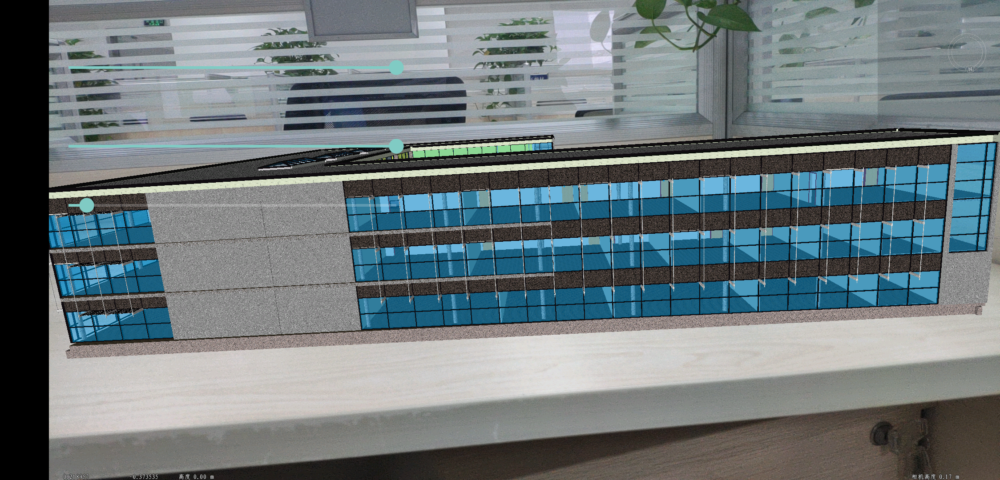
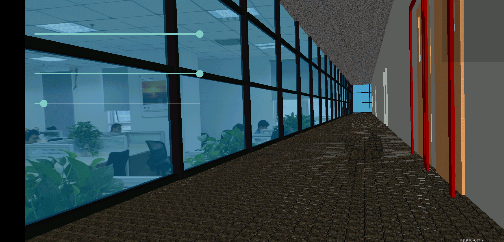
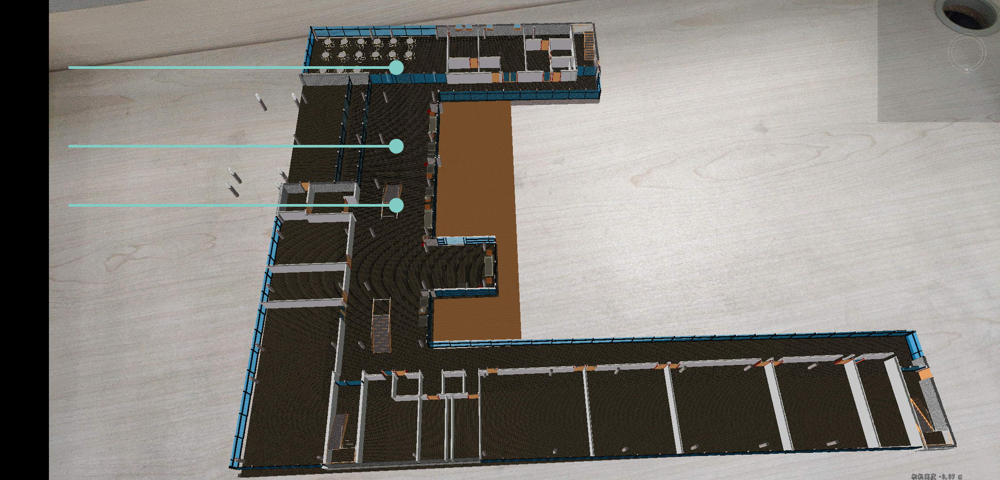

# 3dar

## 范例简介

	示范用户BIM数据放在平面上，剖切功能。

## 示例数据
	将SampleData/BIM/中的数据拷贝到安装目录\SuperMap\data\

## 关键类型/成员

	SceneControl
	Scene
	Workspace
	WorkspaceConnectionInfo
	Environment
	LicenseStatus
	Layer3Ds
	Layer3DOSGBFile
	Layer3D
	ARControl
	Feature3D

##介绍

SuperMap iMobile for Android三维特效模块新增AR（增强现实）功能，支持运动跟踪，平面识别，将虚拟的三维平面场景与现实世界深度融合
##支持的设备

支持 Google ARCore 的设备: 运行 Android 7.0 (Nougat) 及更高版本系统的多种符合资格的 Android 手机上使用 小米： MI 8 MIX2S 华为：P20, P20 Pro Porsche Design Mate RS Mate 20 Lite ...... 

https://developers.google.com/ar/discover/supported-devices?hl=zh-cn（详细设备）
##开发环境
1. 安装 Android Studio 3.1 或更高版本以及 Android SDK Platform 7.0（API 级别 24）或更高版本。

2. 导入产品包库文件。
3. 数据配置 

    （1）.平面场景 osgb/s3m缓存 倾斜、模型 

	（2）.调整缓存数据插入点让模型处于为0,0,0附近 
4. API接口调用 构造函数

	(1) ARControl arControl=new ARControl(activity,sceneControl) AR实现 

	(2) arControl.setARstate(true) 锚点注册击中监听事件

	(3) arControl.setAnchorOnClickListener(AnchorOnClickListener listener) 设置图层放缩 

	(4) arControl.setLayerScale(int layerid,double scale) 设置图层的旋转 

	(5) arControl.setLayerRotation(int layerid,rotX,rotY,rotZ) 设置图层的平移 

	(6) arControl.setLayerTranslation(int layerid,double translationvalue)

##平面识别
1. 选取一块用于识别的区域 桌子 地面等平面。
  
	注意事项：a.不要选取太纯色的区域，比如纯白的桌面。 b. 如果是太纯色的区域，可以在区域上放置一些东西，比如一张有图案的纸。

2. 手机调整姿势对准选取的区域，打开app, 对准的这条线上 前后伸缩（有轨迹运动，会让手机扫描更多的特征点，更容易识别）。
3. 进行第二步操作的过程中，屏幕上弹出 “成功识别第几个屏幕”的字幕后，手点击识别的屏幕（屏幕识别的位置），数据就放在手点击屏幕的位置。
##使用步骤
1. 将SampleData/BIM/中的数据拷贝到Android设备 sd卡中的/sdcard/SuperMap/data/下。
2. 运行程序。
3. 将手机对准平面，成功识别出平面后，点击识别区域，添加场景，剖切操作。

## 效果展示

