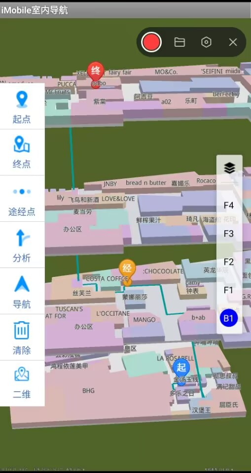

# 3dnavi

## 范例简介
	示范如何运用行业导航模块实现三维室内导航

##示例数据

	数据目录："/sdcard/SuperMap/Demos/3DNaviDemo/"

## 关键类型
	Navigation2
		

## 使用步骤

    (1)点击【设置起点】按钮，在地图上长按一点设置起点
    (2)点击【设置终点】按钮，在地图上长按另一点设置终点
    (3)电机【设置途径点】按钮，在地图上长按设置途径点
    (4)点击【路径分析】按钮，进行路径分析，显示导航路径
    (5)路径分析结束后，若点击【模拟导航】按钮，将进行模拟引导，并在地图上显示引导过程
    (6)导航进行中，若点击【停止导航】，可以停止导航
    (7)停止导航后，点击【清除】按钮，可以清除现有路径结果，再重新分析路径
    (8)点击【二维】按钮，可以将地图切换为二维
    (9)右边为楼层切换 及显示控制按钮

##注意
    需要依赖navigationplus.aar包

	如果运行本范例失败，常见原因是缺少语音资源。
	解决办法：请将产品包中Resource文件夹下的voice文件夹拷贝到工程目录中的assets文件夹下。

## 效果展示

