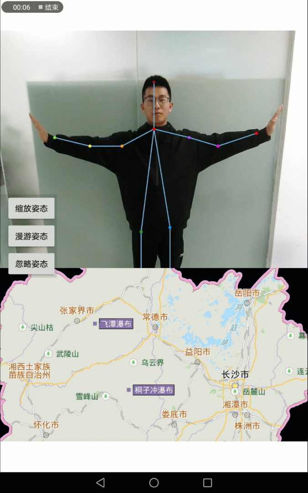

# AI_posenet

## 范例简介

示范通过姿态控制地图缩放。

## 示例数据

数据目录：/sdcard/SampleData/Hunan/Hunan.smwu

## 关键类型/成员

MapControl

MapView

Map

OpenCVLoader

BaseLoaderCallback

## 使用步骤

1. 点击【缩放姿态】按钮，左手和右手缩放控制地图缩放。
2. 点击【漫游姿态】按钮，左手控制左移和上移。

## 效果展示

