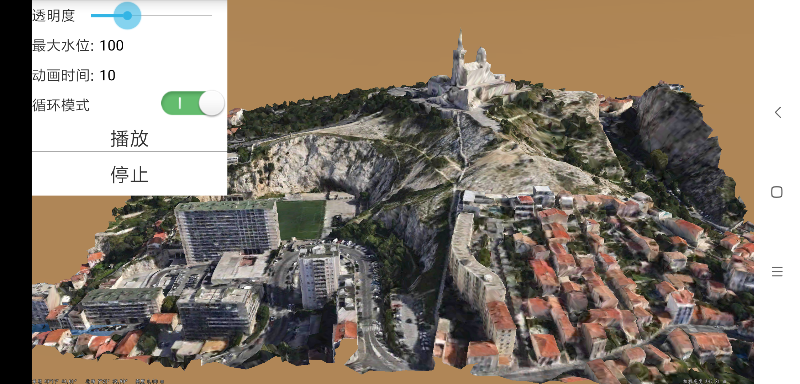

# HypsometricSettingDemo

## 范例简介
	示范用户在Layer3DOSGBFile图层分层设色。

##示例数据

	安装目录\SuperMap\data\MaSai

## 关键类型
	SceneControl
	Scene
	Layer3DOSGBFile

## 使用步骤
	1. 运行程序，按照默认的参数，实现了分层设色动态淹没的效果;
    2. 可以手动拖动进度条更改透明度;
    3. 可以设置最大水位;
    4. 可以设置动画时间;
    5. 可以更改循环模式，循环或者单次;
    6. 播放和停止。

## 效果展示

