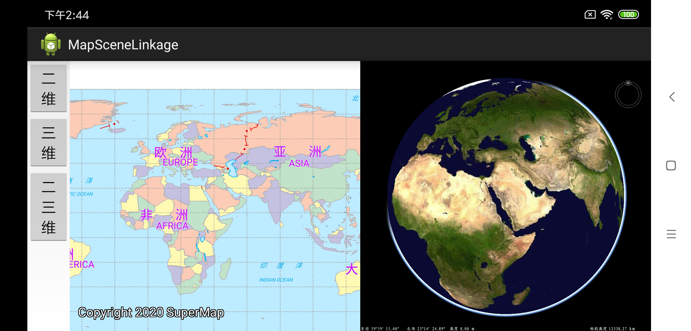

# MapSceneLinkage

## 范例简介
	示范用户二三维联动功能。

##示例数据

	安装目录/SampleData/GeometryInfo/World.smwu

## 关键类型
	SceneControl
	Scene

## 使用步骤
	1. 运行程序;
    2. 点击二维按钮，显示二维地图;
    3. 点击三维按钮，显示三维;
    4. 点击二三维按钮，触摸地图/球 ，实现二三维联动。

## 效果展示

