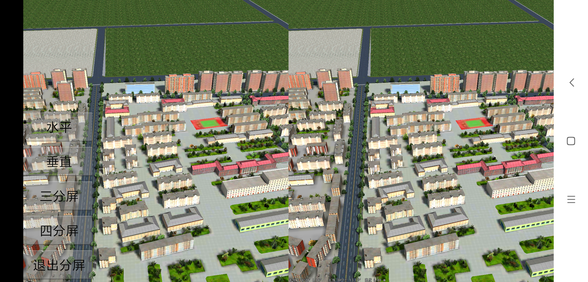

# MultiViewport

## 范例简介
	示范用户如何使用安卓分屏的功能

##示例数据

	安装目录\SuperMap\data\CBD_android

## 关键类型
	SceneControl
	Scene

## 使用步骤
	1. 将SampleData/CBD_android/中的数据拷贝到Android设备 sd卡中的/sdcard/SuperMap/data/下;
    2. 场景名：CBD_android;
    3. 运行程序，初始化直接加载场景;
    4. 根据界面按钮，用户可以选择设置对应的分屏效果，例如：水平分屏，垂直分屏，三分屏，四分屏。

## 效果展示

