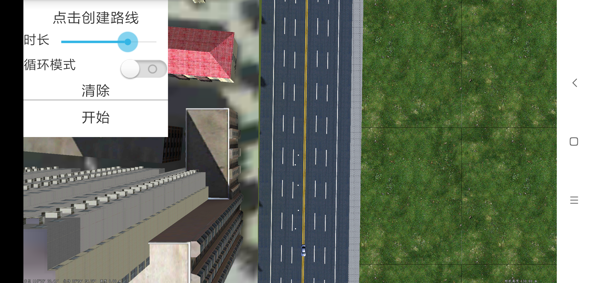

# NodeAnimationDemo

## 范例简介
	示范如何在结点动画功能。

##示例数据

	安装目录\SuperMap\data\CBD_android
	安装目录\SuperMap\data\CBD_android\files\xiaoche-b.SGM 和Textures模型纹理

## 关键类型
	SceneControl
	Scene

## 使用步骤
	1. 运行程序,点击 “点击创建路线”，在屏幕中 触摸屏幕自定义配置动画路线;
    2. 配置时长，默认有初始化时长;
    3. 设置循环模式 默认为动画循环 取消默认为 单次动画;
    4. 点击开始，小车按照自定义路线运行;
    5. 点击清除，然后重复上述步骤。

## 效果展示

