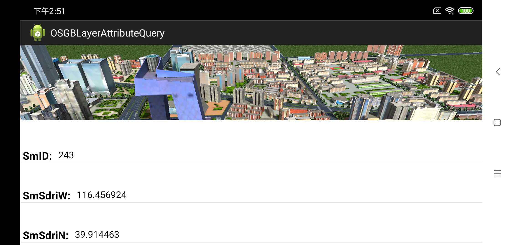

# OSGBModelColor

## 范例简介
	示范用户Layer3DOSGBFile图层设置模型颜色。

##示例数据

	安装目录\SuperMap\data\CBD_android

## 关键类型
	SceneControl
	Scene
	layer3dosgbFile

## 使用步骤
	1. 运行程序;
    2. 读取assets/OSGBModel.json,获取指定id的建筑;
    3. 点击颜色按钮选择颜色，选择透明度，设置指定id建筑的颜色。

## 效果展示

