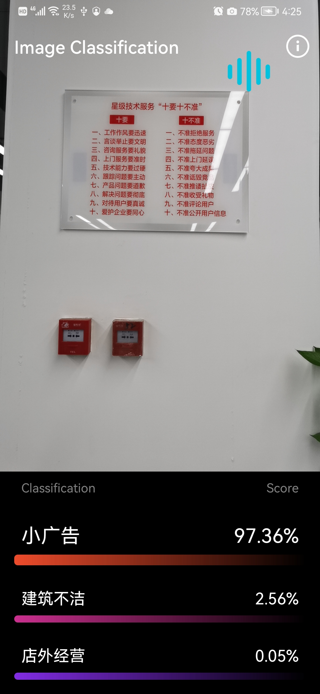

# frequentlyopenmap

## 范例简介
pytorch框架分类识别，可选择图片识别或摄像头实时势必，并将识别结果保存到地图实时显示

## 示例数据

天地图：
GaoDeMaps

## 关键类型

Map
Mapcontrol

	
## 使用步骤

1. 点击选择图片识别，进入选择图片识别Activity。
2. 点击摄像头实时识别，进入摄像头识别Activity。

## 效果展示

