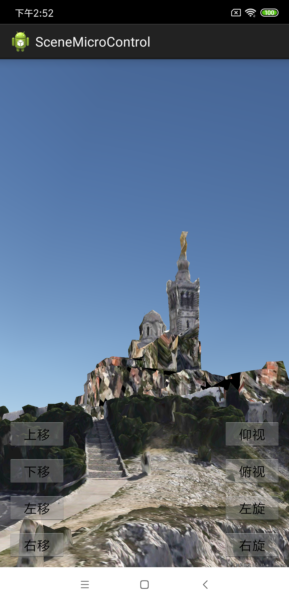

# SceneMicroControl

## 范例简介
	示范用户场景微操作功能。

##示例数据

	安装目录\SuperMap\data\MaSai

## 关键类型
	SceneControl
	Scene

## 使用步骤
	1. 运行程序;
    2. 点击上下左右按钮 ，实现平移效果;
    4. 点击上下俯视按钮，实现俯视仰视效果;
    5. 点击左右选择按钮，实现左右旋转效果。

## 效果展示

