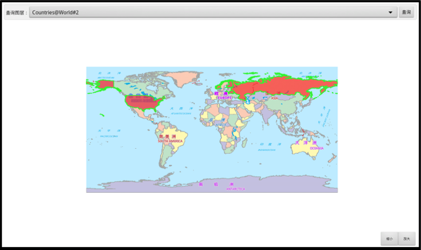

# BoundsQuery

## 范例简介

示范如何对指定范围内的数据进行查询，并在MapControl中展示出来。

## 示例数据

数据目录：/sdcard/SampleCode/BoundsQuery

## 关键类型/成员

GeoStyle

MapView

Map

Workspace

MapControl

DatasetVector

## 使用步骤

1. 点击下拉框选择要查询的图层；
2. 点击【查询】按钮进行相关的查询，查询结果在地图中高亮显示。

## 效果展示

