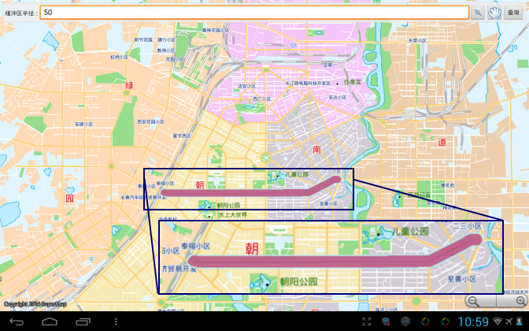

# bufferanalyst

## 范例简介

示范如何对指定范围内的数据进行查询，并在MapControl中展示出来。

## 示例数据

数据目录：/sdcard/SampleData/City/Changchun.smwu

## 关键类型/成员

BufferAnalystParameter

BufferAnalystGeometry

Map

Selecttion

MapControl

GeoStyle

## 使用步骤

1. 在输入框中输入缓冲区半径（必须为数字）；

2. 选择一条用于分析的路径（图中黄色的道路）；

3. 点击相应的按钮进行相关的查询，查询结果在地图中以选择集的方式展现出来。

## 效果展示

