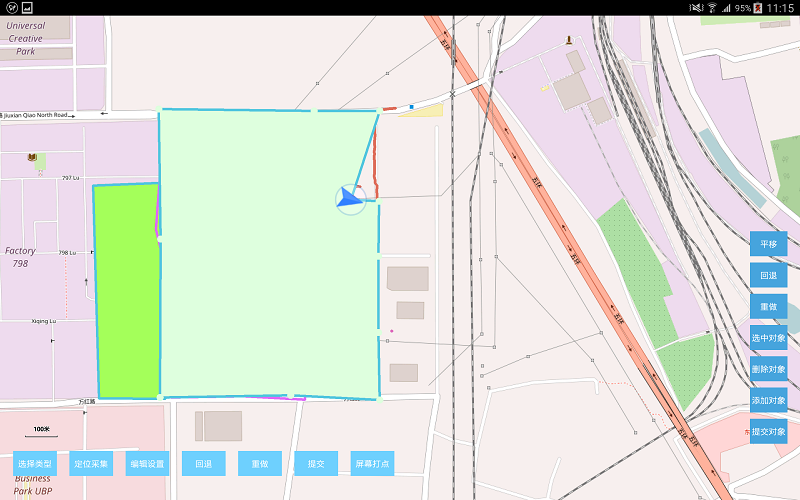

# collector

## 范例简介

示范如何进行GPS式几何对象采集。

## 示例数据

数据目录：/sdcard/SampleData/CollectorData

## 关键类型/成员

Collector

##枚举/常量

GPSData

## 使用步骤

1. 运行程序,点击【选择类型】按钮，选择采集对象类型；
2. 点击【定位采集】按钮，进行采集；
3. 点击【编辑设置】按钮，设置采集对象名称、说明和风格（采集对象名称、说明和风格可在采集开始前设置，也可在采集结束未提交时进行设置）；
4. 点击【回退】按钮，进行回退操作（提交前有效）；
5. 点击【重做】按钮，进行重做操作（提交前有效）；
6. 点击【屏幕打点】按钮，进行屏幕打点采集操作（在GPS采集过程中可结合屏幕打点操作）；
7. 点击【提交】按钮，对采集的几何对象进行提交操作；
对象采集完成后，可通过屏幕右侧按钮栏对采集的几何对象进行编辑操作。

## 效果展示

