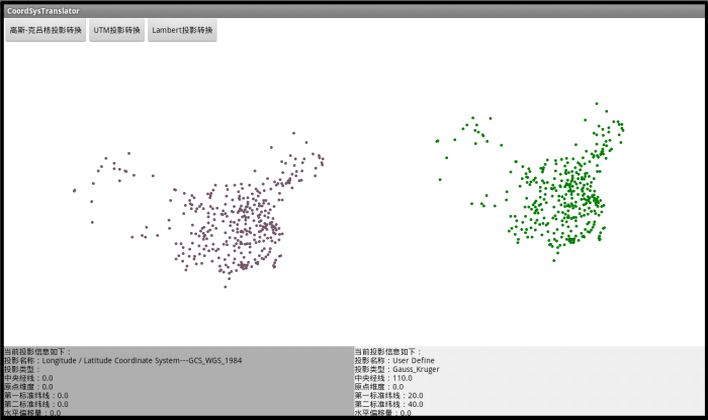

# CoordSysTranslator

## 范例简介

打开一个地图，通过按键实现地图投影转换，以及对比投影转换前后效果。

## 示例数据

数据目录：\sdcard\SampleData\CoordSysTranslator\CoordSysTranslation.smwu

## 关键类型/成员
Workspace
 
WorkspaceConnectionInfo	

MapControl	

Map	

Datasets
 
DatasetVector	
 
DatasetVectorInfo

PrjCoordSys

CoordSysTranslator

## 使用步骤

1. 点击界面上方的投影转换方式按钮设置投影转换的类型；
2. 界面中的两张图形即为投影转换前后的对比结果图形；
3. 滑动界面下方的滚动条可查看转换前后的投影坐标系信息。

## 效果展示

