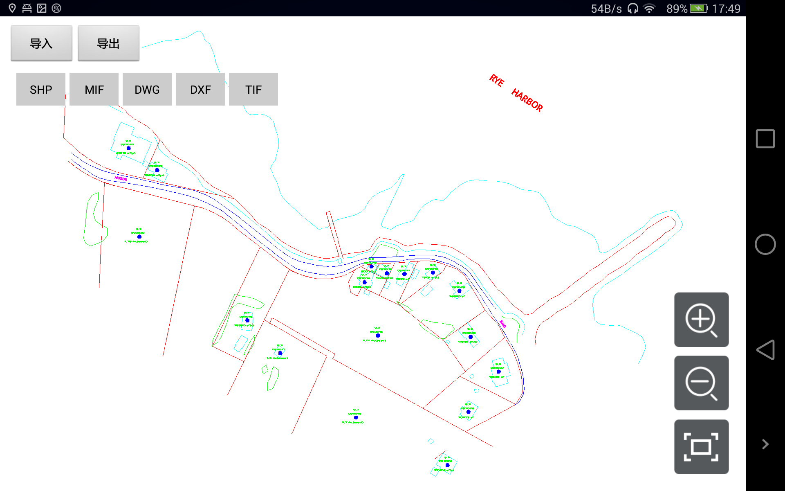
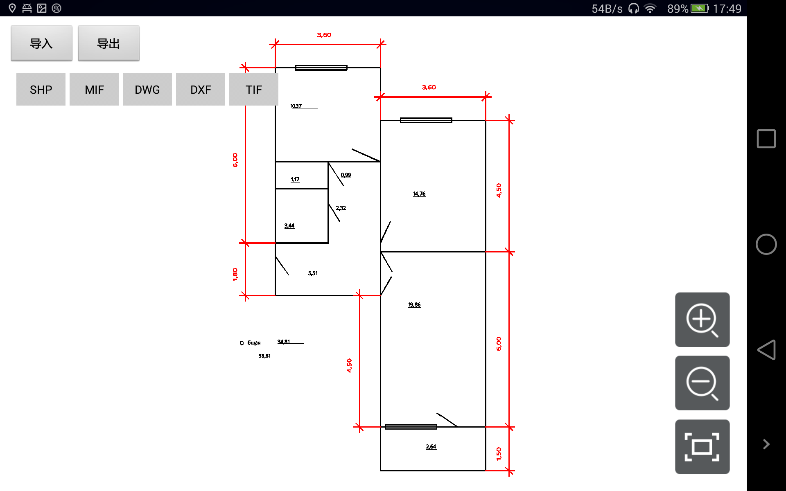

# dataconversion

## 范例简介

范如何进行shp、mif、tif、dwg、dxf格式数据的导入导出。

导入导出还支持kml、kmz格式数据的导入导出，使用方法类似，具体接口请查看DataConversion的详细接口说明。

## 示例数据

数据目录：\sdcard\SampleData\DataConversion

## 关键类型/成员
Workspace
 
WorkspaceConnectionInfo	

MapControl	

Map	
 
DataConversion

## 使用步骤

1. 点击【导入】按钮，选择导入的文件类型，进行数据导入操作；
2. 点击【导出】按钮，选择导出的文件类型，进行导出操作；

## 效果展示

