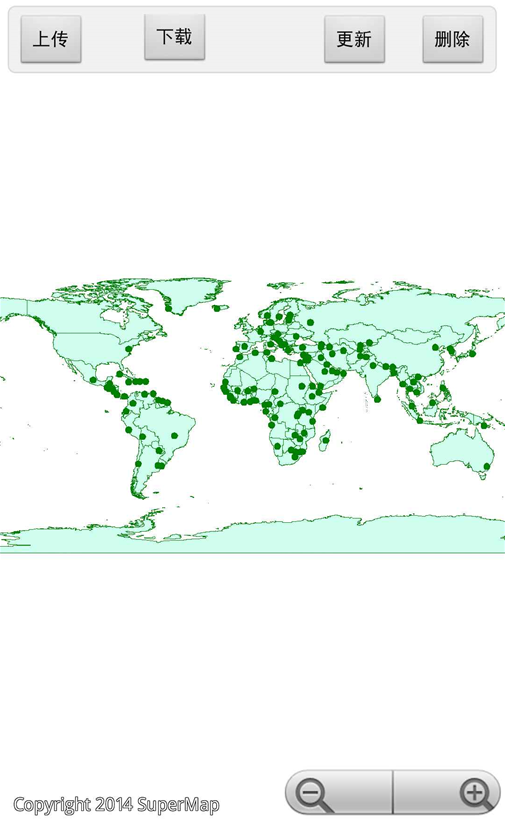

# dataservice

## 范例简介

示范如何使用数据服务功能。

## 示例数据

数据目录：\sdcard\SampleData\GeometryInfo\World.smwu

## 关键类型/成员
Workspace
 
WorkspaceConnectionInfo	

DataDownloadService

DataUploadService	

## 使用步骤

1. 点击【下载】按钮，下载数据集，提示下载成功或失败；
2. 点击【删除】按钮，删除数据集部分对象，提示删除成功或失败；
3. 点击【上传】按钮，上传数据集对象，提示上传成功或失败；
4. 点击【更新】按钮，更新数据集，提示更新成功或失败。

## 效果展示

