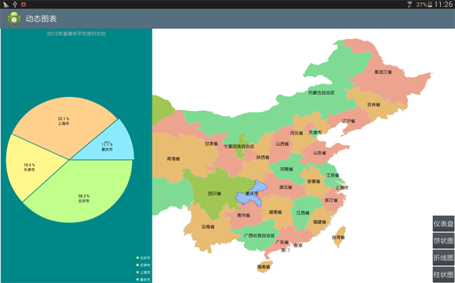
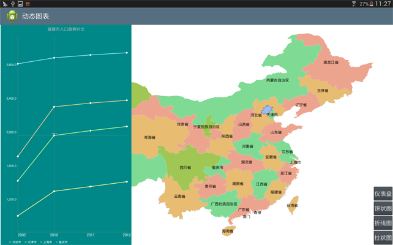
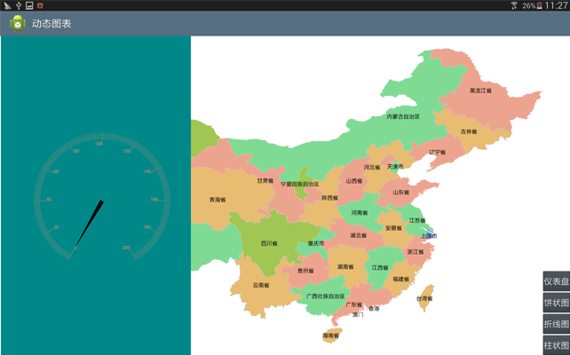
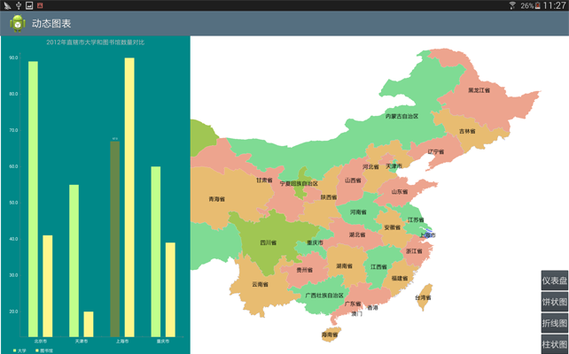

# DynamicChart

## 范例简介
示范如何制作动态图标：柱状图、饼状图、折线图、仪表盘。

## 示例数据

数据目录：\sdcard\SampleData\DynamicChartData\China400.smwu

## 关键类型/成员
Recordset
 
Data	

PieChart

LineChart	

## 使用步骤

1. 创建、显示折线图
2. 创建、显示饼状图
3. 创建、显示柱状图

## 效果展示

