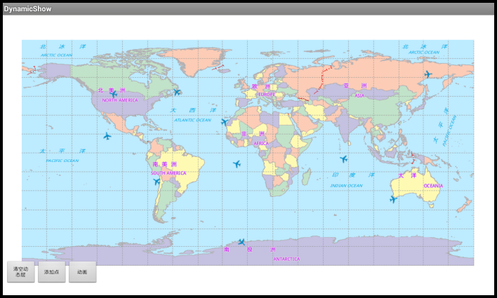

# dynamicshow

## 范例简介
示范如何使用动态层。

## 示例数据

数据目录：\sdcard\SampleData\GeometryInfo\World.smwu

## 关键类型/成员
DynamicView
 
DynamicElement	

## 使用步骤

1. 点击【添加点】按钮，添加动态点对象；
2. 点击【动画】按钮，添加动画；
3. 单击【清空动态层】按钮，清空动态元素。

## 效果展示

