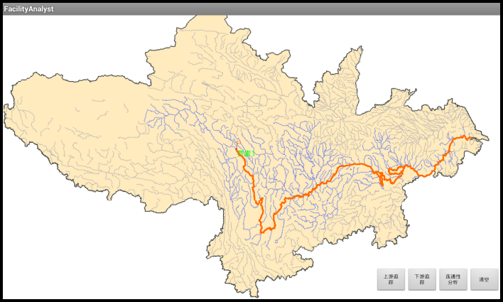

# dynamicshow

## 范例简介
示范如何进行设施网络分析，并在MapControl中展示出来。

## 示例数据

数据目录：\sdcard\SampleData\FacilityAnalyst\FacilityAnalyst.smwu

## 关键类型
FacilityAnalystSetting
 
FacilityAnalyst	

## 使用步骤

1. 在地图上长按，进行节点选择；
2. 选中节点之后（进行连通性分析时，选中点至少有两个），点击相关分析按钮，进行分析，结果在地图中展现出来；
3. 单击【清除】按钮，重新选取节点，进行分析。

## 效果展示

