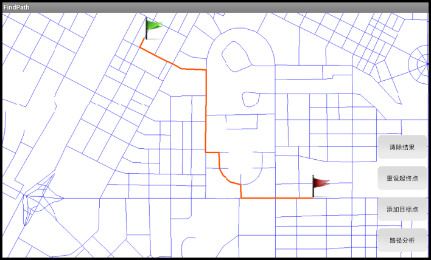

# FindPath

## 范例简介
示范如何进行最短路径分析，并在MapControl中展示出来。

## 示例数据

数据目录：\sdcard\SampleData\City\Changchun.smwu

## 关键类型
TransportationAnalystSetting
 
TransportationAnalyst

TransportationAnalystParameter	

## 使用步骤

1. 点击【设置起点】按钮，长按地图选取起点；
2. 点击【添加目标点】按钮，长按地图选取目标点（可以设置多个目标点）；
3. 点击【路径分析】按钮，进行分析，结果在地图中展现出来；
4. 点击【清除结果】按钮，清除分析结果；
5. 点击【重新设置起点】按钮，进行下一次分析。

## 效果展示

