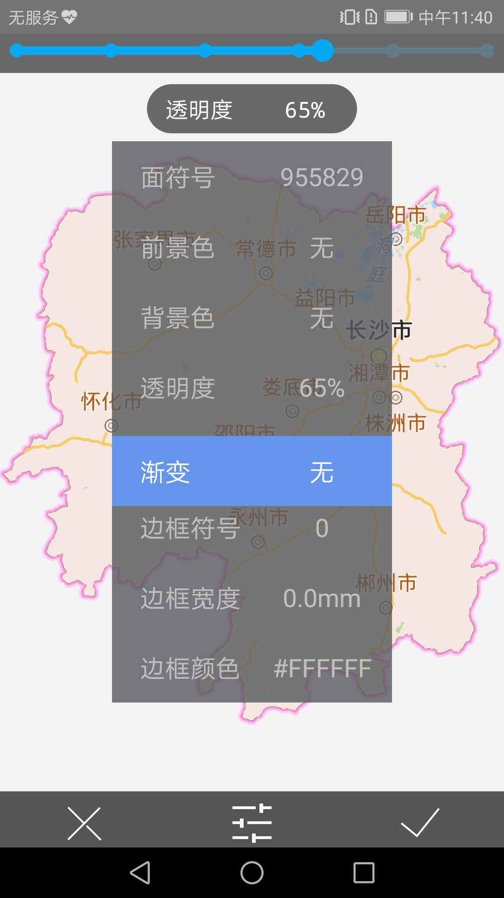

# fingerslip

## 范例简介
示范通过指划操作配制地图风格。

## 示例数据

数据目录：\sdcard\SampleData\Hunan\Hunan.smwu

## 关键类型
GeoStyle

Map

MapControl

## 使用步骤
1. 选择图层-湖南面，单指上下滑动，修改面风格
2. 选择图层-省会，单指上下滑动，修改点风格
3. 选择图层-国道，单指上下滑动，修改线风格
## 效果展示

