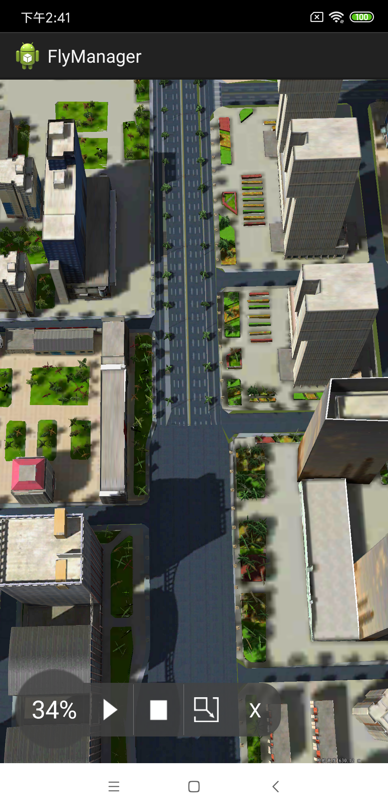

# FlyManager

## 范例简介
	示范用户使用imobile的根据飞行路线飞行功能。

##示例数据

	安装目录\SuperMap\data\CBD_android

## 关键类型
	SceneControl
	Scene

## 使用步骤
	1. 运行程序
    2. 点击框内飞行路线，开始飞行;
    3. 点击暂停，停止飞行，点击开始，继续飞行;
    4. 点击重置，停止飞行，点击开始，重新飞行;
    5. 点击全屏，全屏飞行，点击屏幕，恢复界面气泡。

## 效果展示

