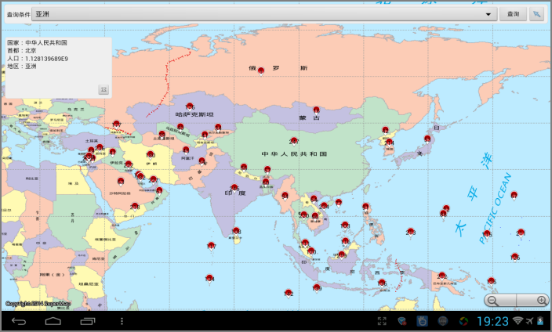

# GeometryInfo

## 范例简介
示范如何查看几何对象的信息。

## 示例数据

数据目录：\sdcard\SampleData\GeometryInfo\World.smwu

## 关键类型
CallOut

QueryParameter

SpatialQueryMode

DatasetVector

Selection

MapView

Map

Mapcontrol
	

## 使用步骤

1. 在查询条件中输入（选择）查询条件；
2. 点击【查询】按钮进行查询，查询结果在地图中展现出来，点击相应Callout，显示详细信息。

## 效果展示

