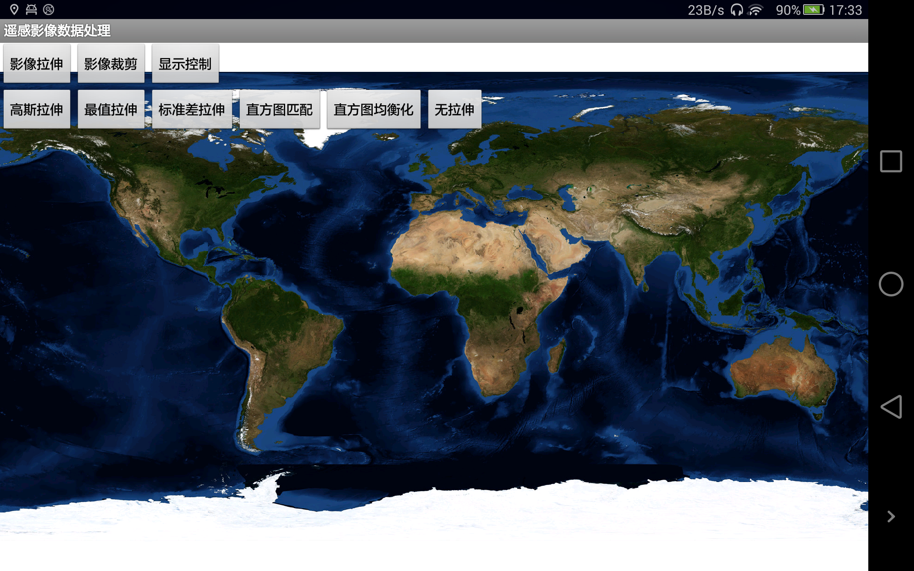
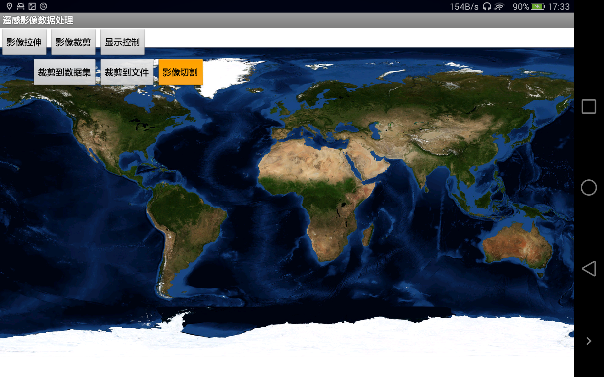
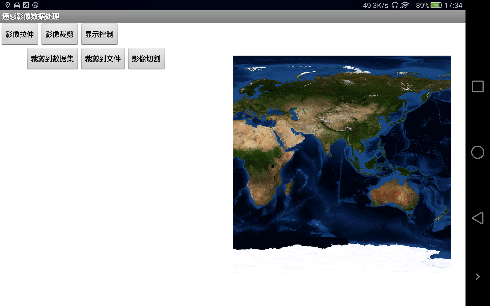

# ImageDataOpration

## 范例简介
示范如何进行影像数据拉伸、裁剪和显示控制。

## 示例数据

数据目录：\sdcard\SampleData\DataImage

## 关键类型
LayerSettingImage

ImageStretchOption

RasterClip

ImageDisplayMode

RasterClipFileType
	

## 使用步骤

1. 点击【影像拉伸】按钮，选择拉伸方式，进行影像数据拉伸操作；
2. 点击【影像裁剪】按钮，选择裁剪方法，进行影像数据裁剪操作；
3. 点击【显示控制】按钮，对影像数据的波段显示进行控制。

## 效果展示

