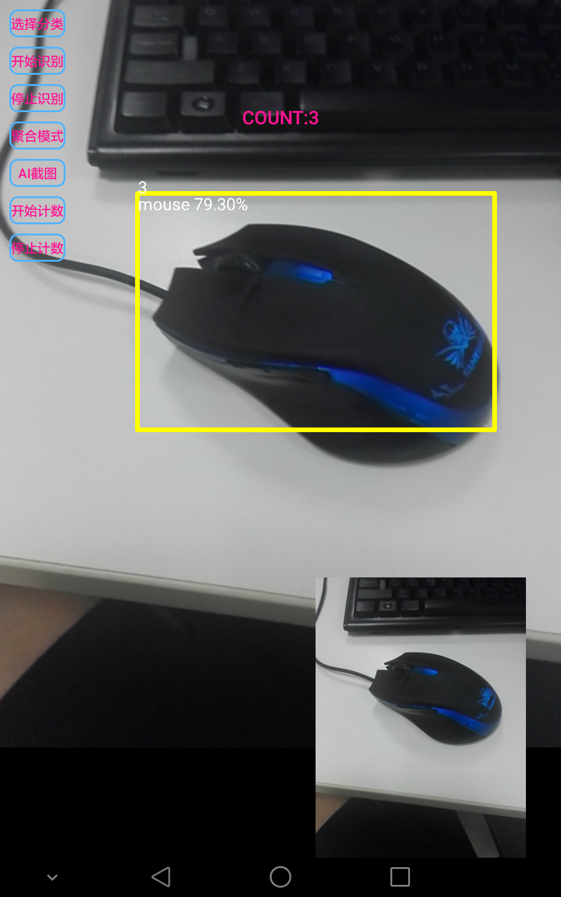

# IMobileAI

## 范例简介
示范如何AI功能进行物体的检测识别。

## 关键类型
AIdetectView
	

## 使用步骤

1. 点击【选择分类】，选择希望进行识别的物件分类。
2. 点击【开始识别】，对摄像头内的物体进行识别检测。
3. 点击【停止识别】，停止对摄像头内的物体进行识别检测。
4. 点击【聚合模式】，将检测目标聚合到一起。
5. 点击【开始计数】，对摄像头内的目标进行跟踪计数。
6. 点击【停止计数】，停止对摄像头内的目标进行跟踪计数。
7. 点击【AI截图】，对当前的AI识别内容进行截图

## 效果展示

