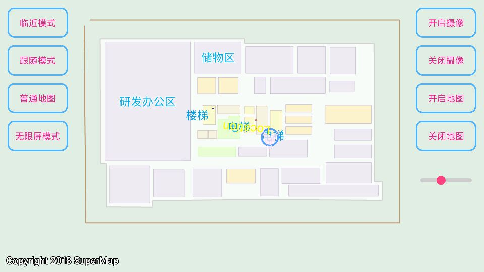

# imobileARcontrol

## 范例简介
示范如何使用AR地图模式。

##示例数据

安装目录\SampleData\AR

## 关键类型
Map

MapView

ArControl2
	

## 使用步骤

1. 点击【临近模式】，可查看附近的POI信息。
2. 点击【跟随模式】，以上帝视角查看地图。
3. 点击【普通地图】，进行普通地图模式下的浏览。
4. 点击【无限屏模式】，移动手机时，地图自动平移。
5. 点击【开启摄像】，开启摄像头。
6. 点击【关闭摄像】，关闭摄像头。
7. 点击【开启地图】，打开当前地图。
8. 点击【关闭地图】，关闭当前地图。
## 效果展示

