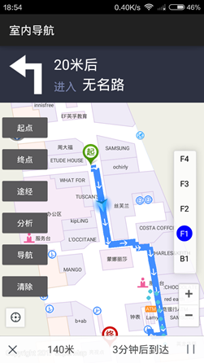

# IndoorNavi

## 范例简介
示范如何进行室内导航。

##示例数据

安装目录\SampleData\IndoorNavigationData\beijing.smwu

## 关键类型
Navigation3

MapView

FloorListView
	

## 使用步骤

1. 添加起点、终点、途径点；
2. 路径分析；
3. 导航；
4. 楼层切换。

## 效果展示

