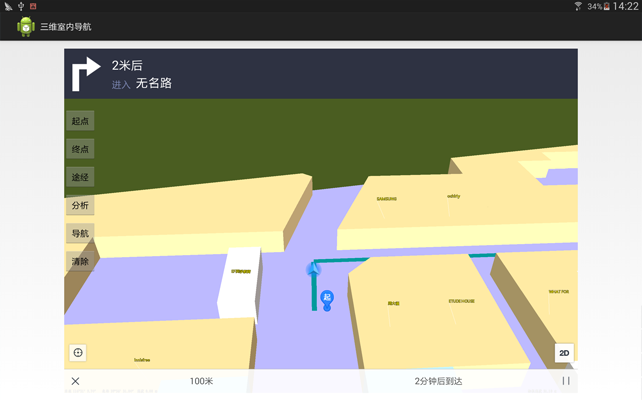

# indoornavigation3D

## 范例简介

示范如何运用导航模块实现三维室内路径分析与导引。

## 示例数据

数据目录：/sdcard/SampleData\IndoorNavigation3DData

## 关键类型/成员

Navigation3D

FloorListView3D	

SceneControl
	
Scene	
## 使用步骤

1. 运行程序,点击【起点】按钮，在地图上长按一点设置起点；

2. 点击【终点】按钮，在地图上长按另一点设置终点；

3. 点击【途经点】按钮，在地图上长按添加途经点；

4. 点击【分析】按钮，进行路径分析；

5. 路径分析结束后，点击【导航】按钮，进行引导，引导过程将在地图中显示出来。

## 效果展示

