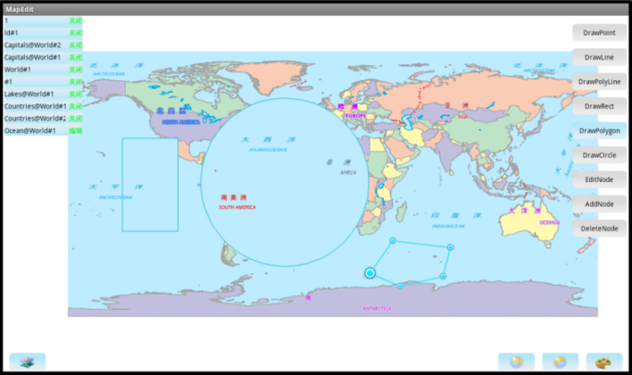

# MapEdit

## 范例简介
打开地图，设置图层可编辑，在该图层上绘制对象，并对对象的节点进行编辑。

##示例数据

安装目录\SampleData\GeometryInfo\World.smwu

## 关键类型
Environment

MapView

MapControl

Action

Map
	

## 使用步骤

1. 点击【图层列表】按钮选择点、线或面图层，设置该图层为可编辑状态；
2. 点击【绘制编辑】按钮选择绘制对象类型及编辑、添加和删除节点；
3. 点击【重做】按钮重新绘制对象，点击【撤销】按钮恢复上次操作状态。

## 效果展示

