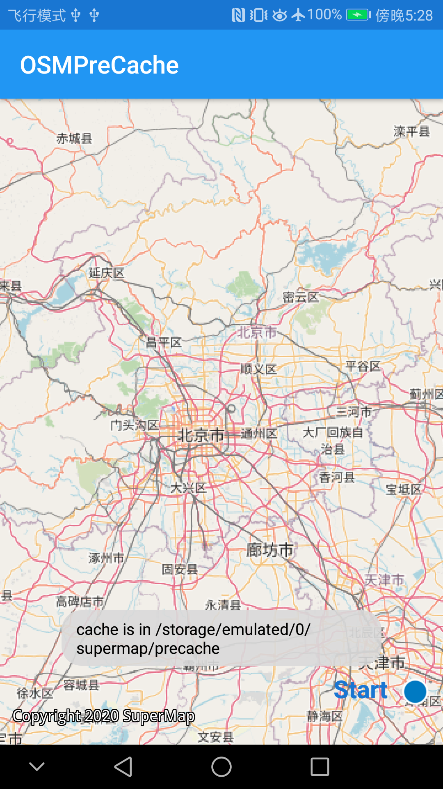

# mapprecache

## 范例简介

OSM在线图指定范围预缓存，停止缓存，删除缓存文件。

## 示例数据

OSM在线图

## 关键类型/成员

MapCacheListener

MapCacheService	

## 使用步骤

1. 点击start按钮，开始地图预缓存。
2. 点击stop按钮，停止缓存。
3. 点击remove按钮，删除缓存文件。

## 效果展示

