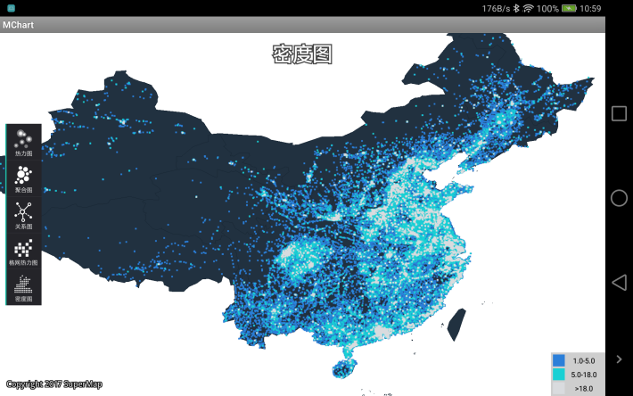

# Mchart

## 范例简介
示范如何进行数据可视化。

##示例数据

安装目录\SampleData\MChartData

## 关键类型
HeatMap

PolymerChart

GridHotChart

PointDensityChart

RelationPointChart

TimeLine
	

## 使用步骤

1. 运行程序,点击 “热力图”按钮，查看热力图显示效果；点击“实时数据”按钮，查看接入实时数据(本例为模拟数据)效果；点击“时空数据”按钮，查看接入时空数据效果；
2. 点击“聚合图”按钮，查看聚合图显示效果；单击聚合地图上的聚合点，查看聚合点打散效果；
3. 点击“关系图”按钮，查看关系图显示效果；单击关系点查看关系图动态效果；
4. 点击“格网热力图”按钮，查看格网热力图显示效果；
5. 点击“密度图”按钮，查看密度图显示效果。
## 效果展示

