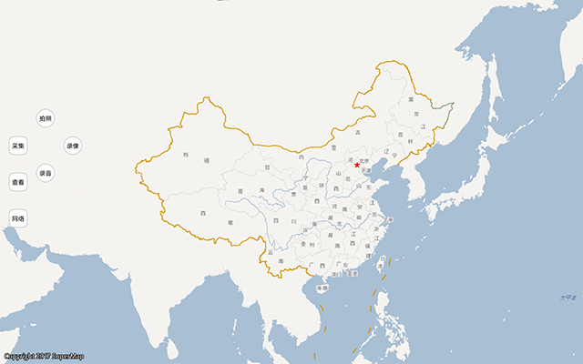

# MDataCollector

## 范例简介
示范如何进行多媒体采集以及数据上传下载。

##示例数据

安装目录\SampleData\MDataCollectorData\media.smwu

## 关键类型
MDataCollector
	

## 使用步骤

1. 点击"采集"，可进行拍照，录像，录音等操作；
2. 点击"查看"，查看已采集的点，点击相应的点自动打开采集的多媒体文件；
3. 点击"网络"，可进行上传或下载等操作，但在上传或下载前，需要根据提示登录iPortal服务。
## 效果展示

