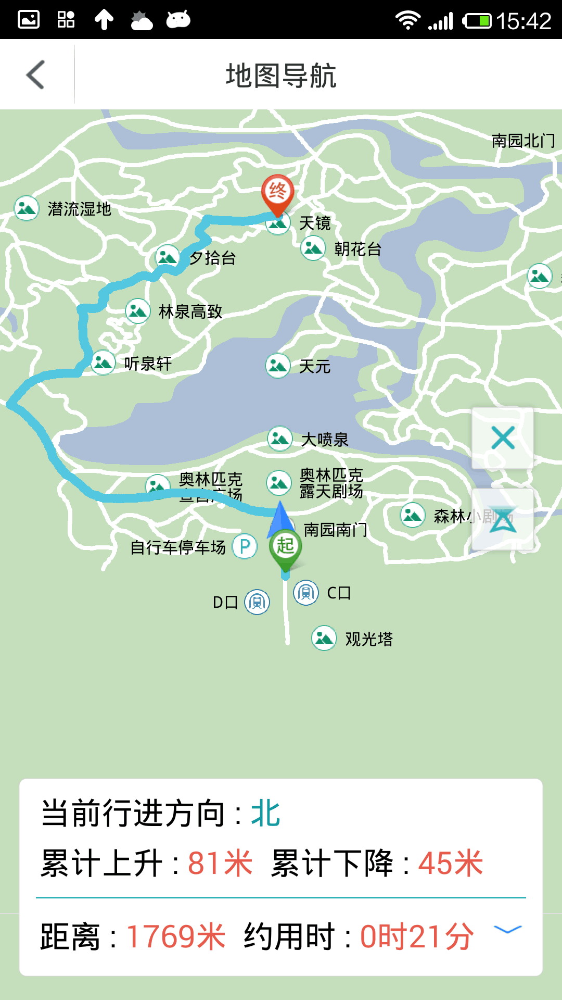

# Navigation2

## 范例简介
示范如何运用行业导航模块实现路径导航。

##示例数据

安装目录\SampleData\Navigation2Data\navi_beijing.smwu

## 关键类型
Navigation2
	

## 使用步骤

1. 点击【设置起点】按钮，在地图上长按一点设置起点；
点击【设置终点】按钮，在地图上长按另一点设置终点；
点击【路径分析】按钮，进行路径分析，显示导航路径；
路径分析结束后，若点击【模拟导航】按钮，将进行模拟引导，并在地图上显示引导过程；
路径分析结束后，若点击【真实导航】按钮，将开始真实导航，并在地图上显示引导过程；
导航进行中，若点击【停止导航】，可以停止导航；
点击【清空记录】按钮，可以清空导航，以重新设置。
## 效果展示

