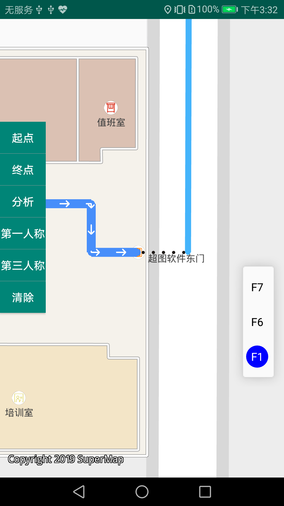

# Naviintegration

## 范例简介
示范增量路网以及室内外一体化导航。

##示例数据

安装目录\SampleData\SupermapNaviData\supermapindoor.smwu

## 关键类型
TopologyProcessing

NetworkBuilder

Navigation2

Navigation3

FloorListView
	

## 使用步骤

1. 增量路网：
 
	点击【编辑路网】按钮，在室内7楼手绘一条路网

	点击【提交】按钮，提交手绘线对象

	点击【自动生成】按钮，可生成室内7楼的增量路网
2. 室内外导航

	右滑界面，点击【室内外导航】选项，打开导航界面

	点击【起点-室内】按钮，在地图上长按一点设置起点

	点击【终点-室外】按钮，在地图上长按另一点设置终点

	点击【分析】按钮，进行路径分析，显示导航路径

	路径分析结束后，若点击【第一人称】按钮，将进行第一人称导航，并在地图上显示引导过程

	路径分析结束后，若点击【第三人称】按钮，将进行第三人称导航，并在地图上显示引导过程

	导航进行中，若点击【停止导航】，可以停止导航

	点击【清除】按钮，可以清除现有路径结果，再重新分析路径

##注意
	如果缺少语音播报，原因是缺少语音资源。

	解决办法: 请将产品包中Resource文件夹下的voice文件夹拷贝到工程目录中的assets文件夹下。
## 效果展示

