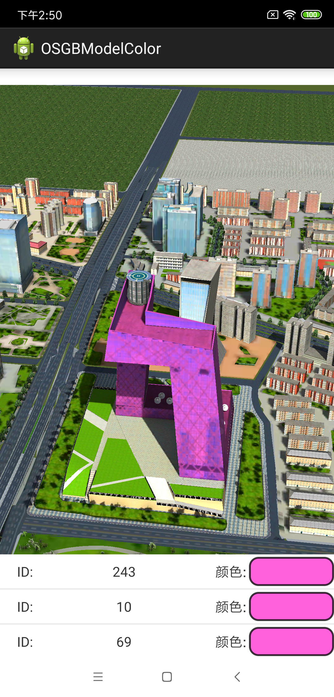

# OSGBLayerAttributeQuery

## 范例简介
	示范用户Layer3DOSGBFile图层查询属性。

##示例数据

	安装目录\SuperMap\data\CBD_android

## 关键类型
	SceneControl
	Scene
	Layer3DOSGBFile

## 使用步骤
	1. 运行程序，按照默认的参数;
	2. 点击单体化建筑，弹出属性信息。

## 效果展示

