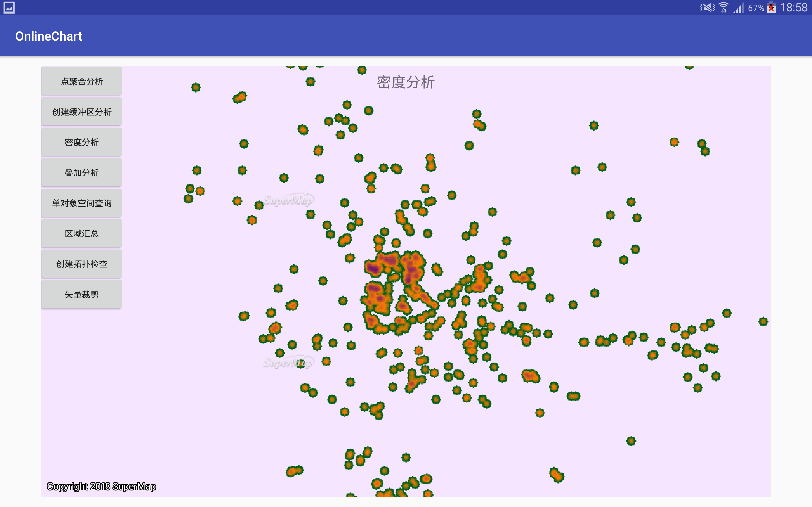

# OnlineChart

## 范例简介
	展示聚合分析、密度分析、缓冲区分析等分布式分析服务。

##示例数据

	安装目录\SampleData\OnlineChartData\chart.smwu

## 关键类型
	AggregatePointsOnline
	
	BufferAnalystOnline
	
	DensityAnalystOnline
	
	OverlayAnalystOnline
	
	QueryOnline
	
	SummaryRegionOnline
	
	TopologyValidatorOnline
	
	VectorClipAnalystOnline
	

## 使用步骤
	1. 点聚合分析
	2. 创建缓冲区分析
	3. 密度分析
	4. 叠加分析
	5. 单对象空间查询
	6. 区域汇总
	7. 创建拓扑检查
	8. 矢量裁剪

## 效果展示

