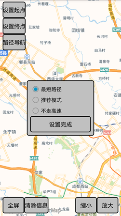

# OnlineService

## 范例简介
	示范如何对接 Online 服务，实现地理编码、在线导航、公交换乘、坐标转换、本地搜索功能。

##示例数据

	安装目录\SampleData\OnlineService

## 关键类型
	NavigationOnline
	
	NavigationOnlineParameter
	
	CoordinateConvertParameter
	
	CoordinateConvert
	
	POIQueryParameter
	
	POIQuery
	
	POIInfo
	
	TrafficTransferOnline

	TrafficTransferParameter
		
	SolutionItem
	
	LineItem
	
	Geocoding
	
	GeocodingParameter
	
	ReverseGeocoding
	
	GeocodingData

	RouteType

## 使用步骤
运行程序,在程序启动页面选择范例功能；

1. 点击【POI查询】按钮，进入POI查询范例界面；

	1）选择查询范围；
	
	2）输入查询关键字；
	
	3）点击查找按钮，进行查询操作。

2. 点击【地理编码与反编码】按钮，进入地理编码范例界面；

	1）选择查询范围，输入查询关键字，点击正向编码按钮，进行正向地理编码操作。
	
	2）输入点坐标，点击逆正向编码按钮，进行正逆向地理编码操作

3. 点击【公交换乘】按钮，进入公交换乘范例界面；

	1）点击设置起点按钮，在地图上长按设置起点；
	
	2）点击设置终点按钮，在地图上长按设置终点；
	
	3）点击点击搜索按钮，进行公交换乘分析操作。

4. 点击【路径导航】按钮，进如路径导航范例界面。

	1）点击设置起点按钮，在地图上长按设置起点；
	
	2）点击设置终点按钮，在地图上长按设置终点；
	
	3）点击路径导航按钮，选择路径规划模式，点击设置完成按钮，查看路径导航结果信息。

## 效果展示

