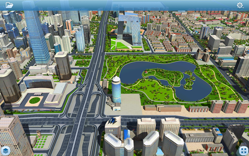

# OpenOfflineScene

## 范例简介
	示范如何打开用户通过iServer下载的离线三维场景数据。

##示例数据

	安装目录\SuperMap\LocalData\CBD

## 关键类型
	Scene
	SceneControl

## 使用步骤
	1. 将SampleData/CBD/中的数据拷贝到Android设备 sd卡中的/sdcard/SuperMap/LocalData/下；
	2. 将程序中url是/SampleData/CBD/下的文件夹名称，sceneName修改为用户通过iServer发布的三维场景名，密码默认是supermap；
	3. 运行程序，点击打开离线场景按钮，打开场景。

## 效果展示

