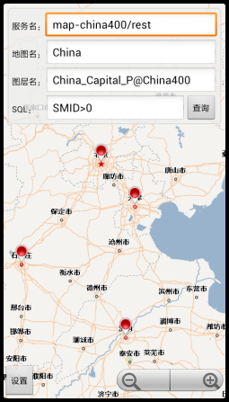

# Service

## 范例简介
	示范如何使用服务模块。

##示例数据

	http://support.supermap.com.cn:8090/iserver/services/map-china400/rest/maps/China

## 关键类型
	QueryService
	
	ServiceQueryParameter
		

## 使用步骤

	1. 点击【设置】按钮，设置服务器地址与端口号；
	2. 输入要查询的服务名称、地图名称、图层名称（本范例程序中填入的服务名称和地图名与底图一致）；
	3. 输入查询语句，点击【查询】按钮，查询结果会在地图上显示。
## 效果展示

