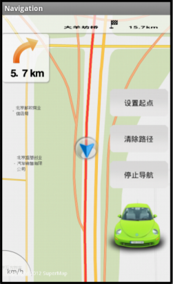

# sinavi

## 范例简介
	示范如何运用导航模块实现路径导航。

##示例数据

	安装目录\SampleData\NaviData

## 关键类型
	Navigation
		

## 使用步骤

	1. 点击【设置起点】按钮，在地图上长按一点设置起点；
	2. 点击【设置终点】按钮，在地图上长按另一点设置终点；
	3. 点击【路径分析】按钮，进行路径分析；
	4. 路径分析结束后，点击【开始引导】按钮，进行引导，引导过程将在地图中显示出来。

##注意
	如果运行本范例失败，常见原因是缺少语音资源。
	解决办法：请将产品包中Resource文件夹下的voice文件夹拷贝到工程目录中的assets文件夹下。

## 效果展示

