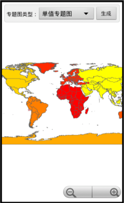

# Theme

## 范例简介
	示范如何制作标签、分段、单值专题图。

##示例数据

	安装目录\SampleData\GeometryInfo\World.smwu

## 关键类型
	ThemeLabel
		
	ThemeLabelItem
	
	ThemeRange
	
	ThemeRangeItem
	
	ThemeUnique

## 使用步骤

	1. 点击专题图类型旁的下拉按钮，选择要生成的专题图类型；
	2. 点击【生成】按钮生成专题图，生成结果将在地图中展现出来。

## 效果展示

