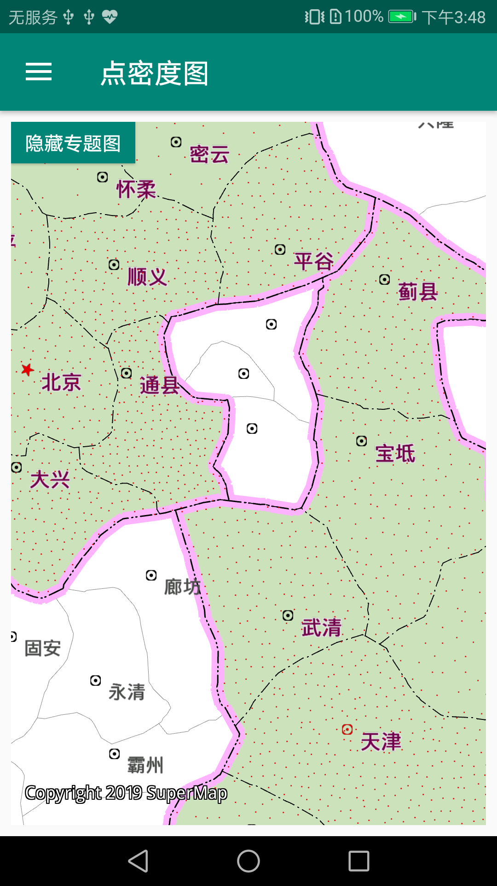

# themevisualization

## 范例简介
	示范点密度图，等级符号图，热力图，网格图。

##示例数据

	安装目录\SampleData\ThematicMaps\ThematicMaps.smwu

## 关键类型

	ThemeDotDensity
	ThemeGraduatedSymbol
	Layers
	LayerHeatmap
	LayerGridAggregation
	LayerGridAggregationType
	

## 使用步骤

	1. 右滑，选择等级符号图
	2. 右滑，选择热力图
	3. 右滑，选择网格图

## 效果展示

