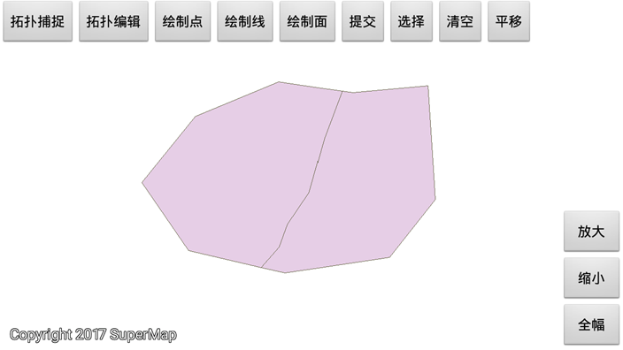

# TopoDataprocess

## 范例简介
	示范如何进行拓扑捕捉与拓扑编辑。

##示例数据

	安装目录\SampleData\TopoDataprocessData\TopoDataprocessData.smwu

## 关键类型
	MapControl
		
	SnapSetting
	
	snapClose
	
	TopoBuild
	

## 使用步骤

	1. 擦除、分割、合并、组合、求交、补充岛洞、填充岛洞
	2. 默认捕捉、全部捕捉、拓扑构面、回退、重做
	3. 绘制点、绘制线、绘制面
	4. 选择对象、平移对象

## 效果展示

