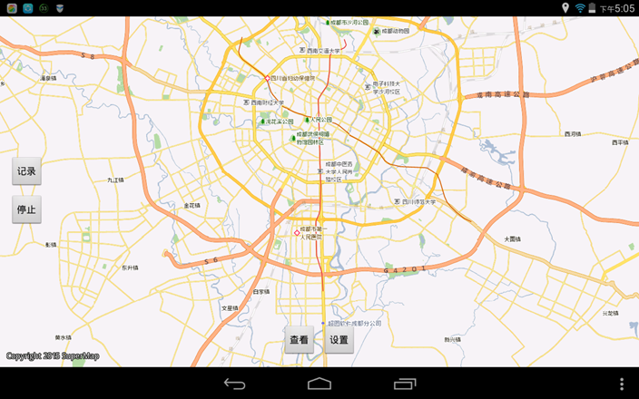

# Track

## 范例简介
	示范如何自动记录轨迹。

##示例数据

	安装目录\SampleData\TrackData\track.smwu

## 关键类型
	Track
	

## 使用步骤

	1. 点击【记录】按钮，设置轨迹名称，开始轨迹记录；
	2. 点击【停止】按钮，可以停止轨迹记录；
	3. 点击【查看】按钮，可以选择需要查看的路径；
	4. 点击【采集】按钮，可以设置当前位置的名称和描述信息；
	5. 点击【设置】按钮，可以进行行参数设置。

## 效果展示

