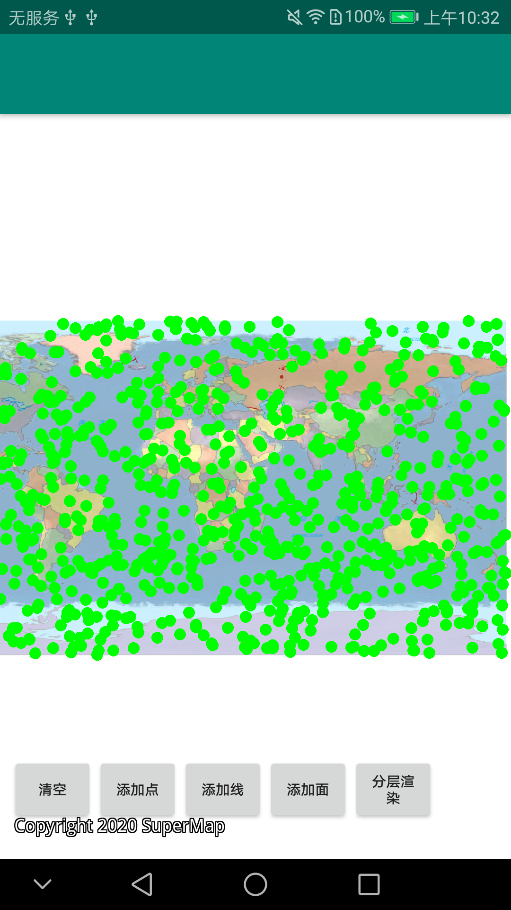

# trackingmap

## 范例简介
	示范跟踪层分层渲染。

##示例数据

	安装目录\SampleData\city\changchun.smwu

## 关键类型
	TrackingLayer

	WorkspaceConnectionInfo

	GeoStyle
	

## 使用步骤

	1. 点击【添加点】按钮，在跟踪层上随机添加点对象。
	2. 点击【分层渲染】按钮，缩放地图。

## 效果展示

