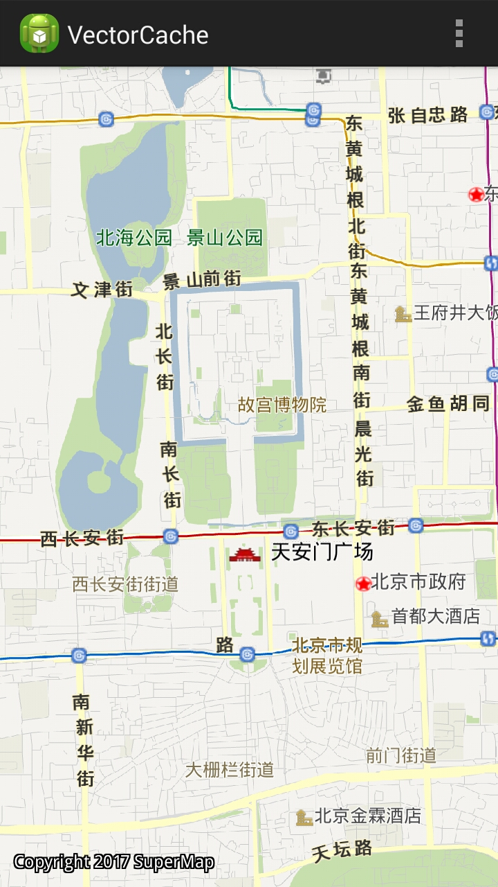

# VectorCache

## 范例简介
	示范如何使用矢量地图包数据。

##示例数据

	安装目录\SampleData\VectorCache\VectorCache.smwu
	解压：安装目录/SampleData/VectorCache/北京_0926.rar 文件为：安装目录/SampleData/VectorCache/北京_0926/北京.xml;

## 关键类型
	Datasource
	Layers

	

## 使用步骤
	
	1. 单指平移地图；
	2. 双指缩放地图；

## 效果展示

